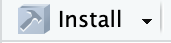
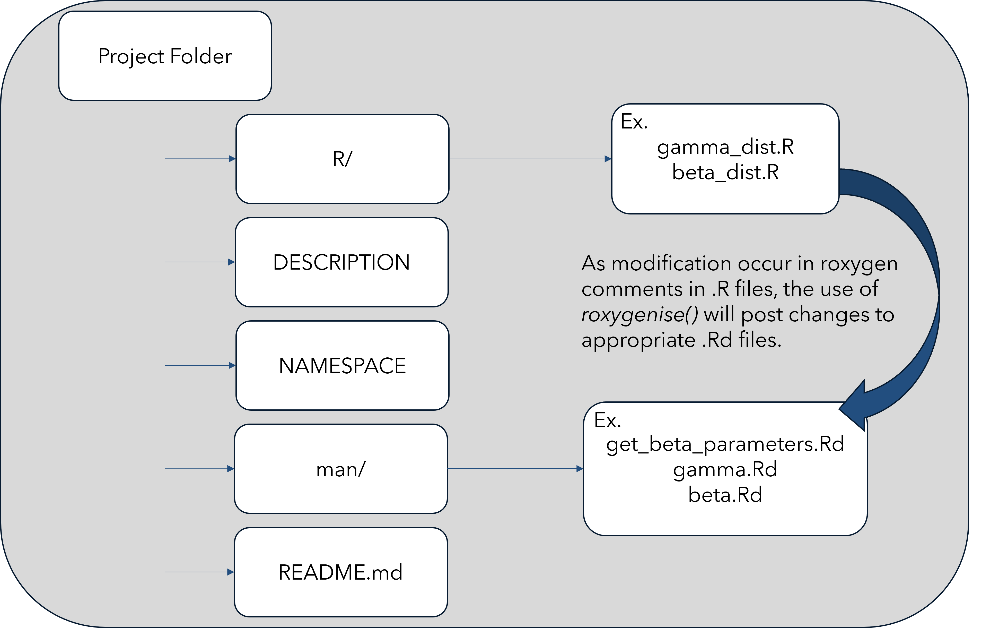
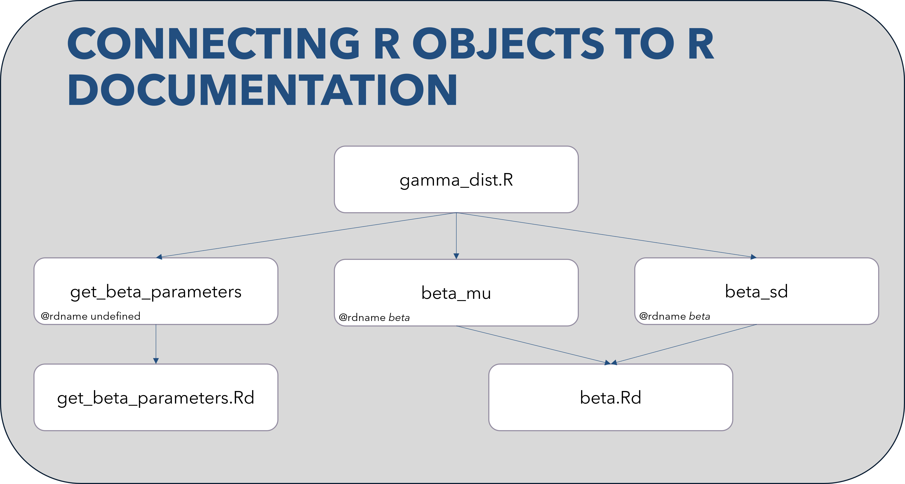

# Expectations of this Presentation
-   This presentation will expand upon the *Good Practices in Reproducible Data Science* series.

-   Using R this interactive presentation will demonstrate how to document your own R packages and objects using the built-in ROxygen2 library.

-   Can use the src/starter_code.R file to help create your own package.

## Documentation
There will be various audiences who will read your code:
* People interested in your research.
* Users of your code/packages. 
* Colleagues and collaborators. 
* Your future self

It’s a good idea to invest time in writing good documentation. Selfishly or selflessly!

### README.md File

The first, and perhaps most important document for any coding project is the readme file. Typically named README.md and is located at the root folder/directory of your project. (You're reading it right now!)

Can use the usethis library to help generate a default README.md file via the *usethis::use_readme_md()* command. 

When working with code repositories like GitHub, the README.md file will be rendered as a nicely-formatted reader-friendly text. Uses the markdown language. 

### DESCRIPTION File
It contains metadata and essential information about the package, including:
* Name/Title
* Version
* Dependencies
* License 
* Authors
* Description

### LICENSE Files
The LICENSE and LICENSE.md files relate to specifying the licensing terms under which the package’s code is distributed. 
* Typically contains the full text of the license under which the package is distributed.
* Typically references the name of the lisence (e.g. MIT), along with terms and conditions of the license. 
* The .md file provides the license in a markdown format.
Can use the *usethis::use_mit_license()* method to generate LICENSE files.

### NAMESPACE File
A namespace file in Roxygen manages the exports and imports of functions and objects within a package.
* Exports: The namespace file specifies which functions, objects, or data sets are meant to be visible to users of the package. It essentially defines the "public interface" of the package.
* Imports: If your package depends on functions or objects from other packages, you can specify these dependencies in the namespace file. 

## ROxygen2 Library
R provides a standard way of documenting packages: you write .Rd files in the man/ directory which connect to corresponding .R files. 

These .Rd files use a custom syntax, loosely based on LaTeX.

The goal of roxygen2 is to make documenting your code as easy as possible and provides a number of advantages over writing .Rd files by hand:
* Code and documentation are adjacent so when you modify your code, it’s easy to remember that you need to update the documentation.
* roxygen2 dynamically inspects the objects that it’s documenting, so it can automatically add data that you’d otherwise have to write by hand.

### Basic Process
There are three steps in the transformation from roxygen comments in your source file to human readable documentation:
1. You add roxygen comments to your source file.
2. *roxygen2::roxygenise()* converts roxygen comments to .Rd files.
R converts .Rd files to human readable documentation.
3. Starts when add specially formatted roxygen comments, which start with **#'**

### Tags
Tags serve as annotations or directives within special comment blocks of roxygen that provide metadata about the code. 

**@title**: The first sentence, is what you see when you look at help(package) and is shown at the top of each help file. Gives a brief ‘title’ to the object. 

**@description**: The paragraph after the first sentence, this comes first in the documentation and should briefly describe what the object does.

**@details**: The third and subsequent paragraphs, this is a (often long) section that comes after the argument description and should provide any other important details of how the function operates. Optional.

**@param**: Tag used to document parameters (arguments) of an object.

**@return**: Tag is used to document the return value of an object.

**@export**: Used to indicate that a specific function should be exported from the package NAMESPACE. 

**@rdname**: By default, the .Rd file associated with objects in R will be titled _name-of-object_.Rd. This tag is used to specify the name of the documentation file where this object's documentation should be placed.

### General Tips
After creating/modifying comments in .R files, can use either method to save changes to .Rd files:
* *devtools::documentation()*
* *roxygen2::roxygenize()*
It’s also good to click the _Build > Install_ button in Rstudio  , which will restart R and install the package, after you have made major changes. Changes may not be reflected until a restart is initiated. 

### Overall Package Structure w/ ROxygen

### Connecting R Objects to R Documentation (e.g. beta_dist.R)

# Zero-setup R-Studio with GitHub Codespaces

This is the repository supporting the BD-STEP Biannual Meeting presentation "Data Science Tutorial".

You can recreate the demos in the talk using the steps outlined below.

## Dev Containers in GitHub Codepaces

If you have access to GitHub CodeSpaces, click the green "<> Code" button at the top right on this repository page, and then select "Create codespace on main". (GitHub CodeSpaces is available with [GitHub Enterprise](https://github.com/enterprise) and [GitHub Education](https://education.github.com/).)

To open RStudio Server, click the Forwarded Ports "Radio" icon at the bottom of the VS Code Online window.

In the Ports tab, click the Open in Browser "World" icon that appears when you hover in the "Local Address" column for the Rstudio row.

This will launch RStudio Server in a new window. Log in with the username and password `rstudio/rstudio`. 

* NOTE: Sometimes, the RStudio window may fail to open with a timeout error. If this happens, try again, or restart the Codepace.

In RStudio, use the File menu to open the `/workspaces`, folder and then browse to open the file `devcontainers-rstudio`

# Resources and Links
* [GitHub Codespaces](https://github.com/features/codespaces) - Available with GitHub Enterprise and GitHub Education
* [Rocker](https://www.rocker-project.org/) - Containers for R 
* [Dev Containers](https://containers.dev/) - Overview and specification
* [Dev Containers in Visual Studio Code](https://marketplace.visualstudio.com/items?itemName=ms-vscode-remote.remote-containers) - Remote-Containers extension 
* [Visual Studio Code](https://code.visualstudio.com/) - Free editor available for Windows, Mac and Linux
* [ROxygen2](https://cran.r-project.org/web/packages/roxygen2/) - roxygen2: In-Line Documentation for R
* [Beta and Gamma Distributions](https://bookdown.org/probability/beta/beta-and-gamma.html) - Beta and Gamma Distributions
